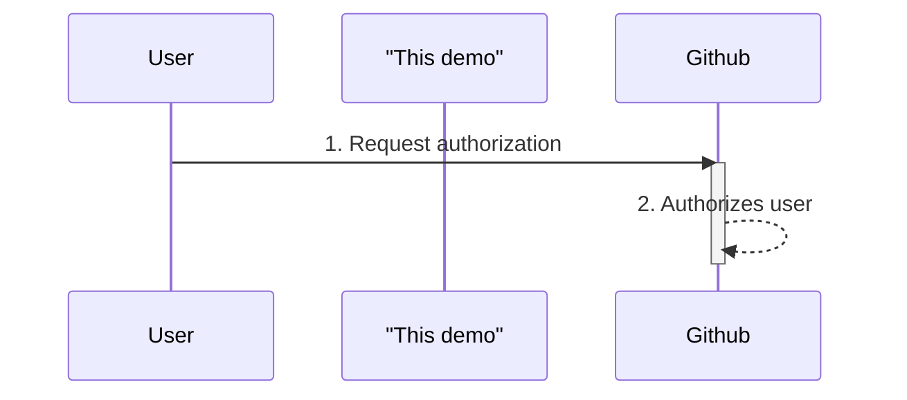

# Overview
This is a Python demo on how to work with GitHub OAuth. You may also use this application to increase your GitHub API quota. For more information on this topic, please see [my blog post]().

# What is OAuth
OAuth stands for Open Authorization, and is a simple protocol to grant third-party application access to user data without giving them the passcodes. Common use cases of OAuth include user authentication (e.g. <ins>login with Github</ins>) and authorizing third-party application to user data ([ByteByteGo made a great video on this](https://youtu.be/ZV5yTm4pT8g). There are normally three players involved in an OAuth process, the user, the data holder (GitHub), and the third-party application (this demo).

